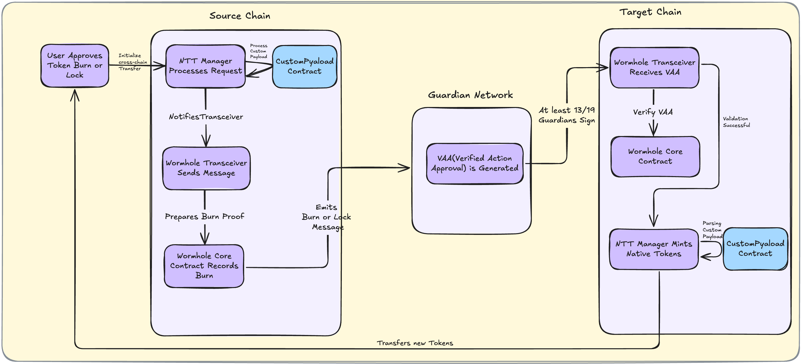

<div align="center">
  
</div>

---

# Overview

This is an example project demonstrating custom Payload implementation based on the Wormhole Native Token Transfer (NTT) framework. Wormhole NTT is an open, flexible, and composable framework for transferring tokens across blockchains without requiring liquidity pools. Integrators have complete control over how their native transfer tokens (NTT) behave on each chain, including token standards and metadata.

For existing token deployments, the framework can be used in "lock" mode, maintaining the original token supply on a single chain. Alternatively, the framework can be used in "burn" mode to deploy native multi-chain tokens with supply distributed across multiple chains.

## Architecture Design

NTT consists of two fundamental components:

(1) **Transceiver**: This contract is responsible for sending NTT transfers forwarded by the `NttManager` on the source chain and delivering them to the corresponding peer `NttManager` on the target chain. Transceivers should implement the `ITransceiver` interface. Transceivers can be defined independently of the Wormhole core and can be modified to support any verification backend. For more information, see [docs/Transceiver.md](./docs/Transceiver.md).

(2) **NttManager**: The NttManager contract is responsible for managing tokens and transceivers. It also handles rate limiting and message authentication logic. Note that each `NttManager` corresponds to a single token. However, a single `NttManager` can control multiple transceivers. For more information, see [docs/NttManager.md](./docs/NttManager.md).

<figure>
  
  <figcaption>Figure: NTT Architecture with Custom Payload</figcaption>
</figure>

## Custom Payload Support

A key feature of the NTT framework is support for custom payloads, allowing developers to add additional data during cross-chain transfers:

- **Source Chain**: Custom data can be constructed in the `_prepareNativeTokenTransfer` function to include custom payloads
- **Target Chain**: Custom data can be parsed and processed in the `_handleAdditionalPayload` function

This design enables NTT to support not only simple token transfers but also complex cross-chain application scenarios. By carrying custom payload data, smart contract logic can be automatically triggered on the target chain, such as:
- Writing on-chain event logs
- Calling contract functions like badge distribution, point settlement, or NFT minting
- Even combining complex logic like task validation + state updates

### Source Chain NttManager Execution Flow

When a user initiates a cross-chain transfer on the source chain by calling the `transfer` function, the NttManager executes the following flow:

```
transfer
  └─▶ _transferEntryPoint  ← 🔥 Burn or Lock Tokens
       ├─▶ _transfer                 
			└─▶├─▶ _prepareNativeTokenTransfer ← ✨ Construct Cross-chain Payload (supports customization)
		       ├─▶ _sendMessageToTransceivers  ← 🚀 Forwarded by Transceiver to Wormhole network broadcast
```

**Detailed Explanation:**

1. **transfer**: Entry function called by users, specifying target chain, recipient address, transfer amount, and other information
2. **_transferEntryPoint**: Processes tokens according to the configured mode (lock/burn):
   - **Locking Mode**: Locks user tokens
   - **Burning Mode**: Burns user tokens
3. **_transfer**: Executes core transfer logic
4. **_prepareNativeTokenTransfer**: Constructs the payload for cross-chain messages - this is the key step for custom payloads
5. **_sendMessageToTransceivers**: Sends messages to all registered transceivers
6. **Transceiver**: Receives messages and broadcasts them to the target chain via the Wormhole network

### Target Chain NttManager Execution Flow

When the Wormhole network delivers messages to the target chain, Wormhole's Relayer calls the Transceiver contract, which ultimately triggers the NttManager contract to execute the following flow:

```
executeMsg ─▶ _handleMsg ─▶ _handleTransfer├─▶ _handleAdditionalPayload
                                           └─▶ _mintOrUnlockToRecipient
```

**Detailed Explanation:**
1. **executeMsg**: Receives messages from the Wormhole network
2. **_handleMsg**: Validates message authenticity and origin
3. **_handleTransfer**: Processes core transfer-related logic
4. **_handleAdditionalPayload**: Processes custom payload data - this is the key step for implementing custom functionality
5. **_mintOrUnlockToRecipient**: Processes tokens according to the configured mode:
   - **Locking Mode**: Mints new tokens on the target chain for the recipient
   - **Burning Mode**: Mints new tokens on the target chain for the recipient

## Quick Start

### Complete Deployment Process

#### Step 1: Deploy NTT Token on OP Sepolia

```bash
# Clone the example token project
git clone https://github.com/wormhole-foundation/example-ntt-token.git
cd example-ntt-token

# Set environment variables
export HACKQUEST=0xAe3759Ccc3E0877fFBb4d533a88Bf9AD0F2Df3F8
export OP_PRIVATE_KEY=0xyour_private_key

# Deploy token contract
forge create --rpc-url "https://sepolia.optimism.io" \
  --private-key $OP_PRIVATE_KEY \
  --broadcast src/PeerToken.sol:PeerToken \
  --constructor-args "HackQuest" "HQ" $HACKQUEST $HACKQUEST

# Record token address
export OP_TOKEN_ADDRESS=0x0dc19A2257523E77789e4D6201722C7e382030E7
```

#### Step 2: Mint Tokens

```bash
# Mint 1000 tokens
cast send --private-key $OP_PRIVATE_KEY \
  --rpc-url "https://sepolia.optimism.io" \
  $OP_TOKEN_ADDRESS \
  "mint(address,uint256)" \
  $HACKQUEST \
  1000000000000000000000

# Verify balance
cast call $OP_TOKEN_ADDRESS "balanceOf(address)(uint256)" $HACKQUEST \
  --rpc-url "https://sepolia.optimism.io"
```

#### Step 3: Initialize NTT Project

```bash
# Create new NTT project
ntt new ntt-custom-payload
cd ntt-custom-payload

# Initialize testnet configuration
ntt init Testnet

# Install Foundry dependencies
forge install
```

#### Step 4: Modify NttManager Contract

You need to modify the following two key functions to support custom payloads (refer to course units 5 and 6 for specific details):

**Source Chain NttManager Contract**:
- Modify the `_prepareNativeTokenTransfer` function to construct custom payloads

**Target Chain NttManager Contract**:
- Modify the `_handleAdditionalPayload` function to parse and process custom payloads

#### Step 5: Modify Deployment Script

Modify the NTT project's deployment script located in `evm/script` to support deploying NTT contracts with custom payloads (refer to course units 7 and 8 for specific details).

#### Step 6: Add Source Chain (Optimism Sepolia)

```bash
# Set environment variables
export ETH_PRIVATE_KEY=0xyour_private_key
export OPTIMISMSEPOLIA_SCAN_API_KEY=your_scan_api_key
export OP_TOKEN_ADDRESS=0x0dc19A2257523E77789e4D6201722C7e382030E7

# Add chain to deployment configuration
ntt add-chain OptimismSepolia --local --mode burning --token $OP_TOKEN_ADDRESS

# Record Manager address
export NTT_MANAGER_ADDRESS=0x3e1A1A9Fa0F1F15B4D0f58d60e5358B81b385981
```

#### Step 7: Configure Token Minting Permissions

```bash
# Set NTT Manager as token minter
cast send $OP_TOKEN_ADDRESS "setMinter(address)" $NTT_MANAGER_ADDRESS \
  --private-key $OP_PRIVATE_KEY \
  --rpc-url "https://sepolia.optimism.io"
```

#### Step 8: Deploy Target Chain ERC20 Contract

```bash
# Deploy token on target chain (Arbitrum Sepolia)
git clone https://github.com/wormhole-foundation/example-ntt-token.git
cd example-ntt-token

export HACKQUEST=0xAe3759Ccc3E0877fFBb4d533a88Bf9AD0F2Df3F8
export ARB_PRIVATE_KEY=0xyour_private_key

forge create --rpc-url "https://sepolia-rollup.arbitrum.io/rpc" \
  --private-key $ARB_PRIVATE_KEY \
  --broadcast src/PeerToken.sol:PeerToken \
  --constructor-args "HackQuest" "HQ" $HACKQUEST $HACKQUEST

# Record target chain token address
export ARB_TOKEN_ADDRESS=0xd3DbA4E5cB7c31302ce1FEB95066538Db3061EdC
```

#### Step 9: Add Target Chain (Arbitrum Sepolia)

```bash
# Set environment variables
export ETH_PRIVATE_KEY=0xyour_private_key
export ARBITRUMSEPOLIA_SCAN_API_KEY=your_scan_api_key
export ARB_TOKEN_ADDRESS=0xC2234C848e65200507d06245109b7e491679228E

# Add target chain
ntt add-chain ArbitrumSepolia --local --mode burning --token $ARB_TOKEN_ADDRESS

# Record target chain Manager address
export NTT_MANAGER_ADDRESS=0x25395e7A736DBd38894Bf424B192793c07aE51aF
```

#### Step 10: Configure Target Chain Token Minting Permissions

```bash
# Set target chain NTT Manager as token minter
cast send $ARB_TOKEN_ADDRESS "setMinter(address)" $NTT_MANAGER_ADDRESS \
  --private-key $ARB_PRIVATE_KEY \
  --rpc-url "https://sepolia-rollup.arbitrum.io/rpc"
```

#### Step 11: Configure NTT Network

```bash
# Pull current configuration
ntt pull

# Modify inbound and outbound limit configurations
# Edit deployment.json file to adjust transfer limits

# Push configuration to blockchain
ntt push
```

#### Step 12: Launch Frontend Interface

```bash
# Clone frontend project
git clone https://github.com/wormhole-foundation/demo-ntt-connect.git
cd demo-ntt-connect

# Install dependencies
npm install

# Modify token, blockchain, and other configurations in App.tsx

# Start development server
npm run dev
```

#### Step 13: Test Custom Payload

```bash
# Write message to source chain custom contract
export CUSTOM_PAYLOAD_CONTRACT=0x235c950CF529821d7F14f530bcD0ed63Ea71507F

cast send $CUSTOM_PAYLOAD_CONTRACT "setBlessMessage(string)" "GM, NTT Custom Payload" \
  --private-key $OP_PRIVATE_KEY \
  --rpc-url "https://sepolia.optimism.io"
```

## Deployment Examples

The project includes the following example transactions:

**Source Chain Transaction (Optimism Sepolia)**:
- https://sepolia-optimism.etherscan.io/tx/0x1dfbed30fd89fe215ce88ce722a421949fc6cfbc768ac66fc8f22d986b69d46a#eventlog

**Target Chain Transaction (Arbitrum Sepolia)**:
- https://sepolia.arbiscan.io/tx/0x98ded06ab95ad09a4ff2087ae7ef1d40d993392fff8a1adccd05971854a9e038#eventlog

**Wormhole Scan**:
- https://wormholescan.io/#/tx/0x1dfbed30fd89fe215ce88ce722a421949fc6cfbc768ac66fc8f22d986b69d46a?network=Testnet&view=advanced